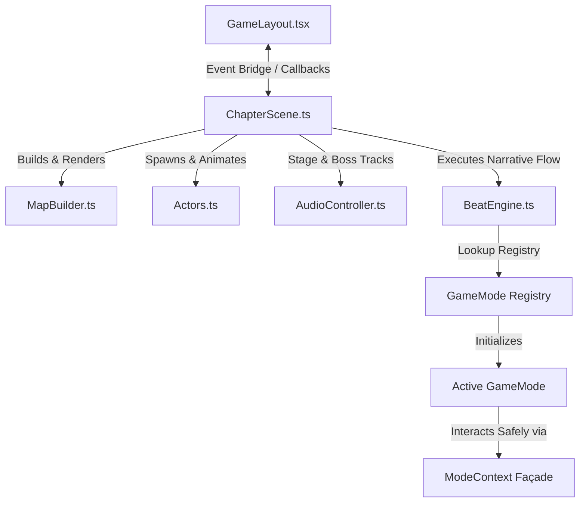

# Technical Architecture Guide — Project Omega: The Rockville Syndicate

A comprehensive guide for understanding, maintaining, and extending the React 19 + Phaser 3.88 linear cosy-RPG engine.

---

## 1. Overview
Project Omega is a story-driven pixel RPG where gameplay consists of linear narrative chapters. Each chapter is configured via declarative static data defining the map layout, roaming characters, and a sequence of "beats" (dialogue, choices, walk-to triggers, pans, and interactive minigames).

### Key Architectural Pillars
1. **Separation of Concerns**: React 19 manages the overlay UI (Dialogue screens, Choices menus, QTE prompts, difficulty settings) while Phaser 3.88.2 handles the physical world (camera, physics, sprite animations, collisions).
2. **Subsystem Delegation**: The main Phaser scene (`ChapterScene.ts`) acts as a thin controller. It coordinates lifecycle events and delegates tasks to specialized collaborator systems: `MapBuilder`, `Actors`, `AudioController`, and `BeatEngine`.
3. **Modular Extensibility (GameModes)**: Combat encounters and custom interactive segments are implemented as sandboxed modes implementing the `GameMode` contract. They interact with the scene strictly through a controlled `ModeContext` façade.

---

## 2. Tech Stack
- **UI & Menus**: React 19 + TypeScript.
- **2D Game Engine**: Phaser 3.88.2 (Running WebGL/Canvas pipelines).
- **Styling**: Tailwind CSS v4 + global custom CSS styling.
- **Build / Packaging**: Vite.
- **Save State**: LocalStorage persistence (`omega-progress-v1`).
- **Tests**: Vitest (Unit) + Playwright (E2E Integration).

---

## 3. Core Systems & Collaborators



### 3.1 Host Scene (`ChapterScene.ts`)
Coordinates preloading, setup, and frame updates. It delegates tick loops to the active collaborator systems and game modes.
- **Preload**: Registers texture files and invokes `preload` on any game modes required by the chapter beats.
- **Create**: Sets up physics boundaries, collision groups (`projectiles`, `enemies`, `enemyProjectiles`, `lootShards`, `walls`), and instantiates the subsystems.
- **Update**: Forwards per-frame update ticks to the player's shadow, depth-sorting, footstep generators, and the active `GameMode`.

### 3.2 Map Builder (`scene/MapBuilder.ts`)
Interprets a chapter's `MapConfig` to build the physical environment.
- Renders background images and decorative surfaces.
- Places invisible static physics bodies for collision boundaries.
- Instantiates furniture props (mapped to atlas frames) and character labels dynamically using `chapter.poolNameplatesConfigs`.

### 3.3 Actors (`scene/Actors.ts`)
Manages character spawning, orientation, and sprite logic.
- Resolves character Class stats (Nick F, Jacob, Eric, etc.).
- Handles understudy replacement rules (substituting missing party members dynamically based on user selections).
- Applies directional walk animations (`idle_front`, `walk_side`, etc.).

### 3.4 Audio Controller (`scene/AudioController.ts`)
Directs sound events and music tracks.
- Auto-plays and loops the designated background track specified by `CHAPTER_MUSIC_KEY`.
- Handles transitions to boss battle loops and playback of victory audio stings.

### 3.5 Beat Engine (`scene/BeatEngine.ts`)
The orchestrator of the chapter's narrative beats. It parses the `beats` array and dispatches tasks:
- `dialogue`: Invokes the React overlay UI to display conversation barks.
- `choice`: Pushes selection choices to React and waits for selection callback to resolve ledgers or jump paths.
- `walkTo`: Spawns a physical marker in-world and holds progression until the player coordinates overlap it.
- `cameraPan`: Cinematic camera pan interpolation.
- `minigame`: Starts a registered game mode. If `background: true` is configured, it launches the mode concurrently and immediately advances the beats; otherwise, it freezes player input and blocks narrative progression until the mode resolves.

---

## 4. The GameMode System (Extensibility)

Interactive elements (like boss fights or swimming scripts) are separated from the main Phaser engine.

### 4.1 The `GameMode` Contract
Located in `src/game/modes/types.ts`. Any new minigame must implement this interface:

```typescript
export interface GameMode<Cfg = unknown> {
  id: string; // Unique string identifier
  preload?(ctx: ModeContext): void;
  start(ctx: ModeContext, config: Cfg, onComplete: (result: ModeResult) => void): void;
  update?(time: number, delta: number): void;
  teardown(): void;
  
  // Optional narrative hooks triggered during active play:
  onDialogue?(beat: any): void;
  onCameraPan?(beat: any): void;
}
```

### 4.2 The `ModeContext` Façade
To prevent minigames from modifying scene properties directly, they interact only with `ModeContext`. This facade exposes a safe API:
- **World & Controls**: Player sprite coordinates, camera, timers, tweens, and keyboard key maps.
- **Audio & Visuals**: AudioController methods, label spawners, text bubbles, damage numbers, and letterbox triggers.
- **Physics Groups**: Projectiles, walls, and enemy arrays.
- **React Bridges**: Dialogue overlay triggers, story logs, and QTE triggers.
- **Scenery Reference Maps**: `propSprites` and `poolNameplates`.

---

## 5. Asset Preprocessing & Packing
To keep resource footprint low, assets are preprocessed inside the browser on startup:
1. **Background Color Keying (`SpritePreprocessor.ts`)**: sample top-left pixels of JPG prop textures and key out matching colors (within Euclidean tolerances) to make backgrounds transparent.
2. **Texture Canvas Extraction**: Crops transparent sprites to their tight bounding boxes and registers them as independent Phaser textures (appending `_crop` suffix).
3. **Atlas Packing (`packSpriteAtlas.ts`)**: Tiles multiple prop textures into a single cached atlas sheet at boot time to reduce GPU draw calls.

---

## 6. AI Agent Development Recipes

### 6.1 How to Add a New Chapter
1. **Create Chapter Config**: Add a new file `src/data/chapters/chapterX.name.ts` implementing `ChapterConfig`.
2. **Configure Map & Beats**: Declare dimensions, spawn positions, wall coordinates, and the linear sequence of `beats`.
3. **Export Chapter**: Open `src/data/chapters/index.ts`, import the new config, and append it to the `CHAPTERS` array.
4. **Register Music**: Import the MP3 audio track in `src/game/audio.ts` and specify its mapping key under `CHAPTER_MUSIC_KEY`.
5. **Preload Sprites**: In `ChapterScene.ts`, add any custom sprite files inside the `preload()` phase.

### 6.2 How to Add a New Minigame Mode
1. **Copy Template**: Copy `src/game/modes/_template/` to `src/game/modes/myMinigame/`.
2. **Customize Logic**: Implement `id` and the lifecycle hooks (`preload`, `start`, `update`, `teardown`).
3. **Register Mode**: Import and call `registerMode(myMinigameMode)` inside `src/game/modes/index.ts`.
4. **Wire to Story**: Insert a `{ type: 'minigame', modeId: 'myMinigame' }` beat inside your chapter configuration's `beats` array.
5. **Detail guidelines**: See [docs/ADDING_A_MINIGAME.md](file:///Users/erichuang/Projects/ai-slop/project-omega_-the-rockville-syndicate/docs/ADDING_A_MINIGAME.md) for context descriptions.

---

## 7. Permanent Gotchas (Do NOT Violate)
- **Never call a side effect inside a React `setState` updater.** StrictMode double-invokes updater functions in dev. Mirror state into a ref, read the ref, then trigger actions **outside** the updater. (See `src/components/GameLayout.tsx`.)
- **Canvas sizing is driven from the scene's `update()` loop** (`syncCanvasToParent()` every frame), NOT from React.
- **Do NOT call `cameras.main.setBounds(0,0,1000,1000)`.** This reintroduces camera framing border black bars. Confine players via physics boundaries and peripheral props instead.
- **Phaser overlap/collider callbacks: never trust argument position.** Identify the intended object by group membership, e.g. `this.projectiles.contains(a) ? a : b`.
- **Route all `add.text` through the `label()` helper.** Blurs raw text; the helper handles correct DPR scaling.
- **Player sprites face right by default;** updates apply `setFlipX(vx < 0)` during travel. Combat overrides this flip state to lock facing toward the aim target.
