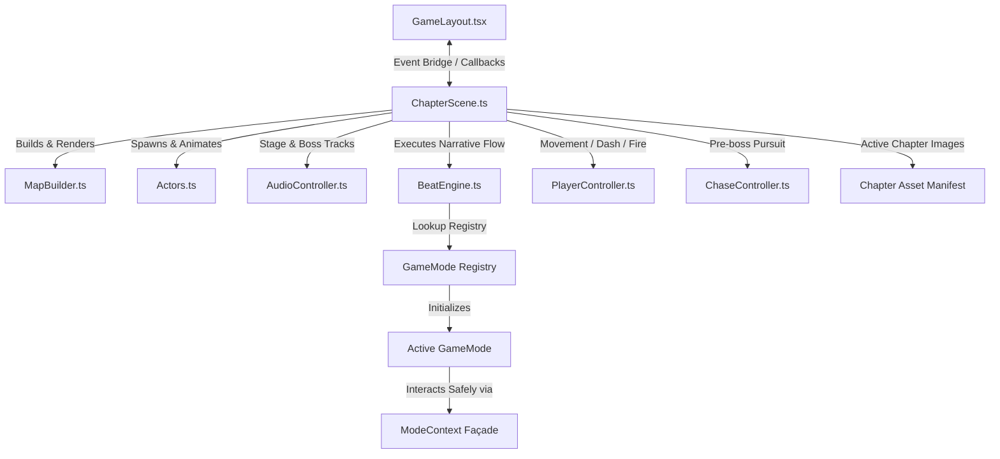

# Technical Architecture Guide — Project Omega: The Rockville Syndicate

A comprehensive guide for understanding, maintaining, and extending the React 19 + Phaser 3.88 linear RPG engine.

---

## 1. Overview

Project Omega is a story-driven pixel RPG where gameplay consists of linear narrative chapters. Each chapter is configured via declarative static data defining the map layout, roaming characters, and a sequence of "beats" (dialogue, choices, walk-to triggers, camera pans, and interactive minigames).

### Key Architectural Pillars

1. **Separation of Concerns**: React 19 manages the overlay UI (dialogue, choices, QTE prompts, difficulty settings, Hall of Records screen) while Phaser 3.88.2 handles the physical world (camera, physics, sprite animations, collisions).
2. **Subsystem Delegation**: The main Phaser scene (`ChapterScene.ts`) is the lifecycle host. It delegates to focused systems including `MapBuilder`, `Actors`, `AudioController`, `BeatEngine`, `PlayerController`, `Atmosphere`, `SpriteLoader`, and `ChaseController`. Six systems depend on narrow structural contracts rather than the entire scene class.
3. **Modular Extensibility (GameModes)**: Combat encounters and custom interactive segments implement the `GameMode` contract and interact with the scene strictly through a controlled `ModeContext` façade.
4. **Unified Persistence**: All save state — settings, story progress, and Hall of Records history — lives in a single versioned `localStorage` blob (`omega-save-v2`) managed by `src/game/settings.ts`. No new ad-hoc keys.

---

## 2. Tech Stack

- **UI & Menus**: React 19 + TypeScript
- **2D Game Engine**: Phaser 3.88.2 (WebGL/Canvas)
- **Styling**: Tailwind CSS v4 + global custom CSS
- **Build / Packaging**: Vite (client) + esbuild (server bundle)
- **Save State**: `localStorage` key `omega-save-v2` — unified blob (settings + progress + Hall of Records)
- **Tests**: Vitest (500+ unit tests) + Playwright (E2E)
- **Quality gate**: ESLint 9 + typescript-eslint; GitHub Actions CI runs on every push/PR

---

## 3. Core Systems & Collaborators



### 3.1 Host Scene (`ChapterScene.ts`)

Coordinates preloading, setup, and frame updates. New cohesive behavior belongs in a subsystem rather than growing the host.

- **Preload**: Loads shared textures plus only the active chapter's typed image manifest, then invokes `preload` on required game modes.
- **Create**: Sets up physics boundaries, collision groups (`projectiles`, `enemies`, `enemyProjectiles`, `lootShards`, `walls`), and instantiates all subsystems.
- **Update**: Resolves input → delegates to `PlayerController`, checks walk targets, and ticks `ChaseController` and the active mode.

### 3.2 Map Builder (`scene/MapBuilder.ts`)

Interprets a chapter's `MapConfig` to build the physical environment.
- Renders background images and decorative surfaces.
- Places invisible static physics bodies for collision boundaries (`mapCollidables`).
- Instantiates furniture props (mapped to atlas frames) and character labels.

### 3.3 Actors (`scene/Actors.ts`)

Manages character spawning, orientation, and sprite logic.
- Resolves character class stats (Nick F, Jacob, Eric, etc.).
- Handles understudy replacement rules (substituting missing party members based on user selection).
- Applies directional walk animations (`idle_front`, `walk_side`, etc.).

### 3.4 Audio Controller (`scene/AudioController.ts`)

Directs sound events and music tracks. Volume is live — it subscribes to the settings store and updates immediately when the player adjusts sliders.
- Auto-plays and crossfades the chapter's stage track (`CHAPTER_MUSIC_KEY`).
- Handles transitions to boss battle loops and victory stings.
- Per-track mix levels defined as constants; use an inline conditional for tracks mastered too quietly rather than touching the global default.

### 3.5 Beat Engine (`scene/BeatEngine.ts`)

The orchestrator of the chapter's narrative beats. Parses the `beats` array and dispatches tasks:
- `dialogue` / `choice`: Invokes the React overlay UI. Never calls side effects inside the React `setState` updater — follows the ref-mirror pattern.
- `walkTo`: Spawns a physical marker in-world and holds progression until the player overlaps it.
- `cameraPan`: Cinematic camera pan interpolation.
- `minigame`: Starts a registered game mode. `background: true` launches concurrently and advances beats immediately; otherwise blocks until the mode calls `onComplete`.

### 3.6 Player Controller (`scene/PlayerController.ts`)

Owns all player-input → game-state logic extracted from ChapterScene:
- **Movement**: velocity from WASD/cursor keys, directional animation, `setFlipX`.
- **Dash**: i-frames, ghost trail effect, Nick F gag, cooldown timer.
- **Auto-fire**: weapon cooldown, projectile spawn, attack animation, flip toward target.
- **Footsteps**: dust puff + sound every 250 ms while moving.

Exposes `isInvuln(now)`, `resetDashCooldown()`, `cancelAttackAnim()`, and `playerInvulnUntil` for the few callers outside the controller (`damagePlayer`, `applyPowerUp`).

### 3.7 Chase Controller and Narrow Scene Contracts

`scene/ChaseController.ts` owns pre-boss chase start/update/finish/reset state. Its reset path never advances narrative state; catch and duration completion converge on one exactly-once finish.

`scene/contracts.ts` defines the actual host surface used by `MapBuilder`, `Actors`, `AudioController`, `PlayerController`, `Atmosphere`, `SpriteLoader`, and `ChaseController`. These structural interfaces prevent subsystem work from depending on the full `ChapterScene` API. `BeatEngine` remains the broad narrative orchestrator until mode hosting is extracted cleanly.

### 3.8 React Bridge Hooks

`components/GameLayout.tsx` hosts Phaser and screen composition. Focused hooks in `components/game/` own story-dialogue and QTE lifecycles. Both mirror callback-bearing state into refs and invoke Phaser side effects outside React state updaters, preserving StrictMode safety.

---

## 4. The GameMode System (Extensibility)

Interactive elements are separated from the main Phaser engine via the mode registry.

### 4.1 The `GameMode` Contract

Located in `src/game/modes/types.ts`:

```typescript
export interface GameMode<Cfg = unknown> {
  id: string;
  preload?(ctx: ModeContext): void;
  start(ctx: ModeContext, config: Cfg, onComplete: (result: ModeResult) => void): void;
  update?(time: number, delta: number): void;
  teardown(): void;

  // Optional narrative hooks (called during active play when a beat fires):
  onDialogue?(beat: Extract<Beat, { type: 'dialogue' }>): void;
  onCameraPan?(beat: Extract<Beat, { type: 'cameraPan' }>): void;
}
```

### 4.2 The `ModeContext` Façade

Minigames interact only through `ModeContext`. This façade exposes:
- **World & Controls**: Player sprite, camera, timers, tweens, physics, keyboard keys.
- **Audio & Visuals**: AudioController methods, label spawners, text bubbles, damage numbers, letterbox triggers.
- **Physics Groups**: `projectiles`, `walls`, `enemies`, `enemyProjectiles`, `lootShards`.
- **React Bridges**: `onStoryDialogue`, `logMessage`, `triggerQTE`.
- **Scenery Maps**: `propSprites`, `poolNameplates`.

To add a new capability to a mode, **extend the façade** with a clear name — don't reach into scene internals.

---

## 5. Persistence — Save Schema v2

`src/game/settings.ts` is the single source of truth for everything persisted. It owns:

```
omega-save-v2 (localStorage)
├── version: 2
├── settings: { masterVolume, musicVolume, sfxVolume, muted, textScale,
│               textSpeedMs, difficulty, colorBlind, reduceMotion }
└── progress:
    ├── completedChapters: string[]
    ├── hero?: string
    ├── freePlay?: boolean
    ├── rose_silence?: boolean
    ├── runRecords?: RunRecord[]      ← Hall of Records history (≤100 entries)
    └── chapterBests?: Record<string, number>
```

On first load without a v2 blob, it migrates the four legacy v1 keys and writes the unified shape. Corrupt JSON falls back to defaults without throwing.

Public API:
- `getSettings()` / `saveSettings()` / `updateSettings()` — synchronous, notifies subscribers
- `useSettings()` — React hook (built on `useSyncExternalStore`, StrictMode-safe)
- `subscribeSettings(fn)` — for Phaser/non-React code
- `getProgress()` / `saveProgressData()` — raw progress read/write
- `saveRunRecord(record)` — appends run, updates chapter best, caps at 100
- `getChapterBest(chapterId)` — returns 0 if never played
- `getRunRecords()` — newest first

---

## 6. Hall of Records / Scoring

`src/game/scoring.ts` — pure functions, no Phaser dependency:

```
score = (shardsCollected × 200 + max(0, hpRemaining) × 10 + max(0, ledgerTotal) × 5)
        × difficultyMultiplier   (0.75 easy / 1.0 normal / 1.5 hard)
```

`GHOST_TARGETS` is a hardcoded constant of five in-joke crew scores (ERH 5200, NKF 4850, NBF 4100, ARL 3320, SJF 2810). Ghost targets are never written to storage.

Run records are emitted from `ChapterScene` via `onChapterCompleted({ shardsCollected, ledgerTotal, hpRemaining })`, computed and persisted in `GameLayout.tsx`.

---

## 7. Asset Preprocessing & Packing

Shared assets and active-chapter assets are registered separately. `game/assets/chapter/` maps chapter ids to typed image manifests, so an active chapter does not preload unrelated chapter art. Assets are then preprocessed inside the browser:

1. **Manifest Selection (`game/assets/chapter/index.ts`)**: Returns only the image keys/URLs for the active chapter.
2. **Background Color Keying (`SpritePreprocessor.ts`)**: Samples top-left pixels of JPG prop textures and keys out matching colors.
3. **Texture Canvas Extraction**: Crops transparent sprites to tight bounds and registers independent Phaser textures.
4. **Atlas Packing (`packSpriteAtlas.ts`)**: Tiles shared prop textures into a cached atlas. Atlas sources that must exist before first construction remain shared.

---

## 8. Development Recipes

### 8.1 How to Add a New Chapter

1. **Create Chapter Config**: Run `npm run agent:scaffold-chapter -- <index> <slug>` and replace its TODO content.
2. **Configure Map & Beats**: Declare dimensions, spawn positions, wall coordinates, and the linear `beats` array.
3. **Export Chapter**: Open `src/data/chapters/index.ts`, import the new config, and append it to `CHAPTERS`.
4. **Register Music**: Import the MP3 in `src/game/audio.ts` and add its mapping to `CHAPTER_MUSIC_KEY`.
5. **Register Chapter Images**: Add a typed manifest under `src/game/assets/chapter/` and map the chapter id in its `index.ts`.
6. **Validate Efficiently**: Run `npm run agent:check -- <chapter-file>` and the chapter validator before playtesting.

See [`docs/chapter-pipeline/`](docs/chapter-pipeline/) for the full authoring pipeline.

### 8.2 How to Add a New Minigame Mode

1. **Copy Template**: `cp -r src/game/modes/_template/ src/game/modes/myMinigame/`
2. **Implement Lifecycle**: Fill in `id`, `preload`, `start`, `update`, `teardown`.
3. **Register**: `registerMode(myMinigameMode)` in `src/game/modes/index.ts`.
4. **Wire to Story**: Add `{ type: 'minigame', modeId: 'myMinigame', config: {...} }` to a chapter's `beats`.

See [`docs/ADDING_A_MINIGAME.md`](docs/ADDING_A_MINIGAME.md) for the full guide.

---

## 9. Permanent Gotchas (Do NOT Violate)

> The full list lives in `CLAUDE.md`. These are the costliest traps:

- **Never call a side effect inside a React `setState` updater.** StrictMode double-invokes updaters in dev — this skipped every other story beat once. Mirror to a ref, run the effect outside.
- **Canvas sizing is driven from `scene.update()` via `syncCanvasToParent()` every frame**, not from React. ResizeObserver and setInterval are unreliable in embedded contexts.
- **Do NOT call `cameras.main.setBounds(0,0,1000,1000)`.** This reintroduces black bars on wide viewports. Confine players via physics world bounds + perimeter walls.
- **Phaser overlap/collider callbacks: identify by group membership**, never argument order (`group.contains(a) ? a : b`). Positional assumptions have destroyed the wrong object.
- **All Phaser text through `label()`** — it applies `resolution: max(2, dpr*2)`. Raw `add.text` renders blurry.
- **Player sprites face right by default.** `update()` sets `setFlipX(vx < 0)`; boss combat overrides this to face the aim target. That override is intentional — preserve it.
- **All persistence through `settings.ts`** — never a new ad-hoc `localStorage` key.
- **Verify against the code, not the handoff docs.** Files under `docs/archive/` are archived and may describe an earlier build.
