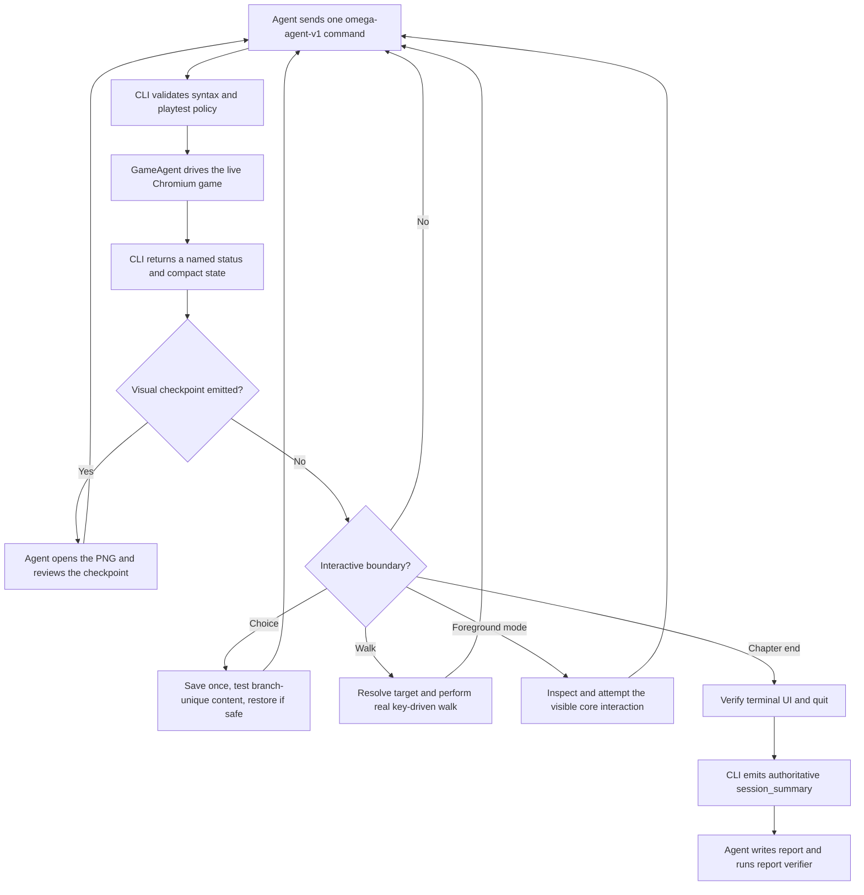

# Human Reference: How Chapter Playtesting Works

This document explains the autonomous one-chapter playtest system for maintainers. It is not part of the playtesting agent's operating prompt; the concise agent contract lives in `.agents/skills/playtesting/SKILL.md`.

## System flow



## Components

| Component | Responsibility |
| --- | --- |
| `e2e_tests/agent/cli.ts` | Owns the persistent session, command routing, checkpoints, evidence, coverage, integrity, and final summary. |
| `e2e_tests/agent/GameAgent.ts` | Converts high-level commands into browser, keyboard, pointer, state, and screenshot operations. |
| `e2e_tests/agent/protocol.ts` | Parses newline-delimited `omega-agent-v1` commands and preserves `cmd_id` correlation. |
| `e2e_tests/agent/playtestPolicy.ts` | Blocks state-changing shortcuts and audits exceptional commands in `--playtest`. |
| `e2e_tests/agent/playtestCompliance.ts` | Enforces checkpoint review and meaningful foreground-mode input before a bypass. |
| `e2e_tests/agent/playtestCoverage.ts` | Records scenes, choices, walks, modes, passive evidence, and terminal observation. |
| `e2e_tests/agent/playtestReport.ts` | Verifies that the human-readable report agrees with the transcript's final summary. |

## Session lifecycle

Start one live browser and keep it open for the chapter:

```bash
npm run agent -- --chapter <chapter-index> --repl --checkpoints --playtest \
  --out "qa/<chapter-id>" \
  --transcript "qa/<chapter-id>/session.jsonl"
```

The driving agent sends one newline-terminated JSON command, waits for the correlated terminal receipt, then decides the next action:

```json
{"protocol":"omega-agent-v1","cmd_id":"advance-001","action":"advance","args":[]}
```

The CLI emits an `accepted` receipt followed by `completed` or `failed`. Automatic events such as `visual_checkpoint` are also written to the transcript.

## The `advance` control loop

`advance` dismisses routine story dialogue and stops at a named state:

| Status | Meaning |
| --- | --- |
| `walk-control` | The player has ordinary movement control. |
| `choice-present` | A visible choice needs deliberate branch coverage. |
| `walk-target-present` | A story movement objective is active. |
| `mode-active` | A foreground mode is blocking story progression. |
| `ambient-dialogue` | Dialogue is occurring over free control; this is not a soft-lock. |
| `chapter-ended` | The terminal chapter beat has been observed. |

The receipt also carries the live beat identity and compact game state. Agents should not request a second full observation when the receipt already answers the routing question.

## How much input does walking require?

Walking does not require frame-by-frame commands. For a story objective, the normal sequence is:

1. `advance` returns `walk-target-present`.
2. `targets` resolves the destination.
3. `walkto <x> <y>` holds and releases real movement keys internally until arrival or failure.
4. The agent continues with `advance`.

A checkpoint can add one required review, so a walking transition normally costs three or four commands. Free movement can be a single timed command such as `press w 1000`.

## Visual evidence

Automatic checkpoints cover scene and mode boundaries. DEV-only beat tracing also captures visually risky passive beats such as camera pans, actor movement, actor visibility changes, chases, screen tints, and ledger effects.

Every checkpoint blocks progression until the agent opens its original PNG and submits:

```text
reviewcheckpoint <id> clear|issue-found|inconclusive <concrete note>
```

The note must describe visible evidence. A coalesced checkpoint can represent several simultaneous transitions. `captureMissed:true` means the effect was not visually verified.

## Choices and modes

At a choice, the agent creates one quick state and checks `branchSafe`. Safe branches are restored without replaying common content. Unsafe branches require a fresh natural run because an inaccurate restore would be worse than the additional time.

Foreground modes must receive normal keyboard or pointer input before the harness permits `winmode` or `losemode`. Background modes run alongside the story, never produce `mode-active`, and must be observed through their start, coexistence, and teardown.

## Integrity and completion

The harness records `skipbeat`, `winmode`, and `losemode` as bypasses. Any bypass changes `playtest_integrity` to `partially-bypassed`; the run can continue for downstream diagnosis but cannot claim verified natural completion.

At `chapter-ended`, the agent reviews the terminal presentation, waits once for the completion handoff, clears any new checkpoint, and quits. Verification requires:

- Complete visual QA with no pending checkpoints.
- Natural integrity with no bypass.
- Runtime terminal observation.

Failure produces `incomplete-visual-qa`, `incomplete-integrity`, or `incomplete-coverage` and a nonzero exit.

## Transcript and report

The transcript is the authoritative execution record. Its final `session_summary` contains console counts, integrity, bypasses, audit entries, visual reviews, and coverage.

The agent currently writes `qa/<chapter-id>/report.md` after the session and verifies it with:

```bash
npm run agent:verify-report -- qa/<chapter-id>/report.md qa/<chapter-id>/session.jsonl
```

The verifier rejects edited canonical evidence, missing pending-checkpoint status, or a completion claim unsupported by the transcript.

### Current reporting limitation

Visual observations are preserved immediately in checkpoint-review receipts. Nonvisual friction discovered between checkpoints currently depends on the transcript and the agent retaining enough context to describe it later. The intended improvement is a structured live findings ledger followed by one generated final report—not repeated edits to report prose during play.

## Token-efficiency profile

The system is designed to spend tokens on evidence and decisions rather than polling:

- `advance` collapses routine dialogue.
- `walkto` performs a complete key-driven walk in one command.
- Checkpoints replace duplicate screenshots.
- Simultaneous transitions share one checkpoint.
- Passive effects are captured without agent polling.
- Branches replay only unique content when restoration is safe.
- Annotation, telemetry, and GIFs are requested only for a specific suspected problem.

The main remaining command overhead in dialogue-heavy chapters is repeated `ambient-dialogue` exits. Checkpoint reviews remain intentionally separate because they are the enforceable proof that the rendered game was inspected.
